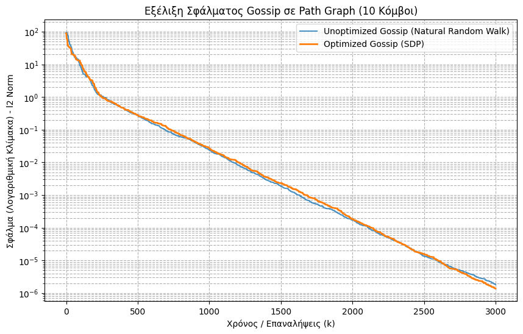

# Randomized Gossip Algorithm: SDP Optimization on Networks

## Executive Summary
This repository explores consensus building in large networks (e.g., sensor networks, distributed databases) using the Randomized Gossip algorithm. The project focuses on accelerating the convergence rate by optimizing the transition probability matrix of the network's random walk using **Semi-Definite Programming (SDP)**. 

## Methodology & Optimization
In a natural random walk, nodes communicate with their neighbors uniformly at random. However, this leads to extremely slow convergence in specific topologies (like Path Graphs). To minimize the consensus error dynamically, this project models the probability matrix $P$ as an optimization problem:

* **Objective:** Minimize the second largest eigenvalue ($\lambda_2$) of the expected averaging matrix $\bar{W}$, which is mathematically equivalent to minimizing the $l_2$-norm of $P - \frac{1}{n}\mathbf{1}\mathbf{1}^T$.
* **Constraints:** $P$ must be a symmetric stochastic matrix (rows sum to 1, non-negative elements) honoring the graph's edge topology.
* **Solver:** Modeled with `cvxpy` and solved using the `SCS` solver to find the mathematically optimal communication probabilities.

## Key Results (Simulation)
The asynchronous simulation compares the unoptimized approach (uniform random walk) versus the SDP-optimized probabilities on a Path Graph topology.

* **Metric:** The error is calculated as the $l_2$-norm of the distance from the perfect average.
* **Conclusion:** The optimized probabilities drastically increase the exponential decay rate of the error, achieving consensus in a fraction of the iterations compared to the natural random walk.

## Tech Stack
* **Optimization & Math:** `cvxpy` (Convex Optimization)
* **Graph Theory:** `networkx`
* **Data Science:** `numpy`, `matplotlib`

## Repository Structure
* `/notebooks/`: Contains the Jupyter Notebook (`Gossip_Algorithm_SDP.ipynb`) with the mathematical modeling, solver configuration, and asynchronous simulation loop.
* `/assets/`: Convergence charts and visualizations generated from the model.
